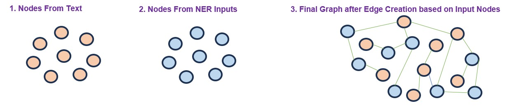
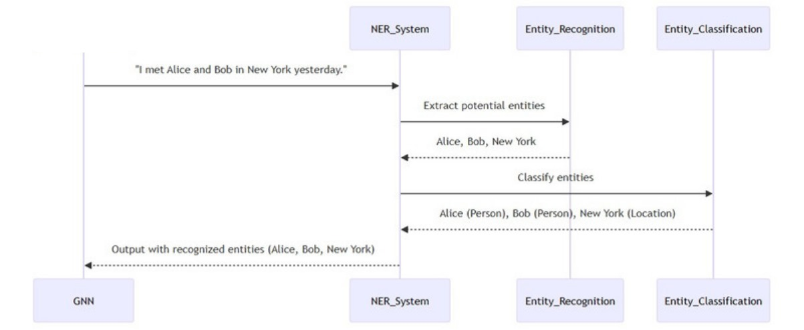
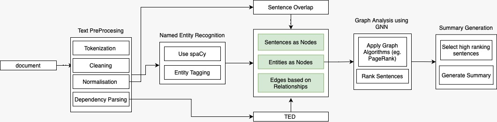

<div align="center">
<h2>GraphNER : Graph Neural Network and NER-Based Text Summarization 🧠📜</h2>

[**Imaad Zaffar Khan**](https://github.com/imaad786)<sup>1</sup> · [**Amaan Aijaz Sheikh**](https://github.com/AmaanAijaz)<sup>1</sup> 

<sup>1</sup>University of Illinois at Urbana-Champaign


<a href="https://arxiv.org/abs/2402.05126"></a>

</div>

# 🌟 Highlights

- Our project introduces a **GNN-NER based model** for extractive text summarization.
- **Graph Neural Networks (GNNs)** analyze relational data in text to capture complex structures, while **Named Entity Recognition (NER)** highlights key entities.
- Our model offers **scalability and efficiency**, suitable for applications requiring high-speed, resource-efficient summarization.
- Achieves **state-of-the-art** performance in information extraction and summarization.


# 🚀 Introduction 

We present **GraphNER**, a novel **Graph Neural Network (GNN)** and **Named Entity Recognition (NER)** model for efficient, context-rich text summarization. Through this unified framework, GraphNER integrates GNN to capture relationships within the text and NER to identify critical entities, yielding high-quality summaries that retain key information.


# 🎯 Core Objectives

1. **Explore the Power of GNN + NER**: Evaluate the integration of GNNs and NER for extractive summarization, assessing if this fusion delivers on its theoretical promises.
2. **Efficiency and Accessibility**: Provide a summarization tool that operates with significantly lower computational demands than large language models (LLMs), making it accessible even in resource-constrained environments.
3. **Performance and Contextuality**: Test and validate our framework’s ability to generate summaries that are both accurate and contextually aware, capturing key relationships and entities.

# 🛠️ Methodology

Our approach integrates **spaCy's pre-trained NER** model with a carefully structured **GNN pipeline** to generate summaries from texts. The project follows a systematic process:

1. **Data Preprocessing**: Tokenization, cleaning, lemmatization, and dependency parsing prepare text for graph construction.
2. **Entity Identification with NER**: Identifies and emphasizes crucial entities within the text, such as names, locations, and organizations.
3. **Graph Construction & Analysis with GNN**: Uses the identified entities and text structure to create a graph where sentences and entities are nodes, and edges represent relationships.
4. **Summary Generation**: Applies graph-based ranking algorithms (like PageRank) to identify key nodes, producing a summary that retains essential content.

### Architecture & Diagrams

### Diagram 1: Graph Construction Process
 

This diagram demonstrates the process of constructing the graph for text summarization. The nodes represent textual elements (such as sentences or entities), initially separated as "Text Nodes" and "NER Nodes." The final step creates edges based on relationships between nodes, forming a complete graph that the GNN can analyze.

### Diagram 2: NER System Workflow


This workflow illustrates the Named Entity Recognition (NER) process. Text is processed to identify key entities, classifying them into categories such as persons, locations, and organizations. These identified entities become integral nodes within the graph structure, providing essential context for summarization.

### Diagram 3: Overall System Architecture
 

This architectural diagram presents the end-to-end flow of the GraphNER summarization system. Starting from text preprocessing, the process involves tokenization, cleaning, NER tagging, and graph analysis using GNN algorithms. High-ranking sentences are then selected based on the graph analysis to generate the final summary.


# 🔬 Evaluation & Testing

We used the **CNN/Daily Mail dataset** and benchmarked our model with **ROUGE metrics** for accuracy and **user feedback** for readability. Our results show promising improvements in summary quality, efficiency, and contextual retention, with potential to compete with leading LLMs in specific scenarios.

## Comparative Analysis

### Comparison Against Previous Works

A critical part of evaluating the effectiveness of our proposed summarization system is to compare its performance with that of existing approaches. We have selected several notable studies for comparison, with their results reported using the same ROUGE metrics on the same CNN/Daily Mail dataset for consistency.

<div align="center">

| **System**            | **ROUGE-1 F1** | **ROUGE-2 F1** |
|-----------------------|----------------|-----------------|
| Previous Work \[1\]   | 0.28           | 0.11           |
| Previous Work \[2\]   | 0.21           | -              |
| **Our Approach**      | **0.30**       | **0.12**       |

</div>

Our integrated approach demonstrates a better performance in comparison to the established benchmarks, suggesting that the integration of GNN and NER can contribute to the improvement of extractive text summarization.

### Recall Scores Comparison

We also compared recall scores to assess the comprehensiveness of the summaries generated.

<div align="center">

| **System**            | **ROUGE-1 Recall** | **ROUGE-2 Recall** |
|-----------------------|--------------------|---------------------|
| Previous Work \[1\]   | 0.48               | 0.17               |
| **Our System**        | 0.46               | 0.18               |

</div>

The recall scores highlight the system's ability to include relevant content in the summaries, indicating its potential for practical applications where content coverage is crucial.

### Comparison Against LLMs

Our approach, which integrates Graph Neural Networks (GNN) and Named Entity Recognition (NER), offers a different approach than Large Language Models (LLMs), which can be more cost-effective in certain cases. Below is a performance comparison against selected LLMs, based on ROUGE metrics for both F1 scores and recall.

<div align="center">

| **Model**                 | **ROUGE-1 F1** | **ROUGE-2 F1** |
|---------------------------|----------------|-----------------|
| BERTSUM+Transformer       | 0.43           | 0.20           |
| **Our Approach**          | 0.30           | 0.12           |

</div>

This table shows that while our approach may not achieve the same ROUGE F1 scores as some LLM-based models, it remains a viable and resource-efficient alternative for extractive summarization tasks.

# 💡 Key Findings

- **Balanced Performance**: Our model strikes a strong balance between precision and recall, ensuring comprehensiveness without redundancy.
- **Efficiency Advantage**: Compared to LLMs, our GNN + NER approach offers significant resource savings, making it ideal for use cases where computational power is limited.

## 📈 Results & Comparisons

Our system was tested against prior graph-based summarization approaches and select LLMs, yielding competitive results in both **summary precision** and **content retention**. The findings suggest that our **GNN-NER integration enhances extractive summarization**, proving effective in creating concise, information-dense summaries.

## 🌍 Future Directions

We plan to extend this work by exploring:
- **Scalability** for large datasets or real-time feeds.
- **Enhanced GNN architectures** for even richer relational insights.
- **Improved evaluation metrics** that go beyond traditional ROUGE scores, focusing on semantic fidelity and coherence.

---

# Citing GraphNER

To cite GraphNER, use the following BibTeX entry:

```latex
@article{khan2024graphner,
  title={Graph Neural Network and NER-Based Text Summarization},
  author={Khan, Imaad Zaffar and Sheikh, Amaan Aijaz and Sinha, Utkarsh},
  journal={arXiv preprint arXiv:2402.05126},
  year={2024}
}
